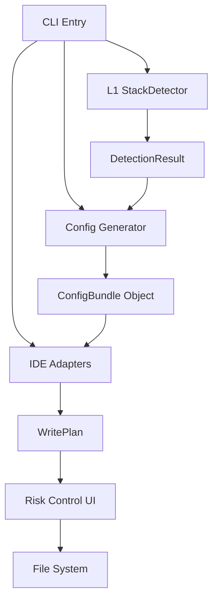

# AI-Pilot PoC 实施计划

> 版本: 1.0
> 创建时间: 2026-01-18
> 状态: Draft
> 负责模型: Claude-Sonnet-4.5, Gemini-2.0-Flash, GPT-5.2

---

## 目录

0. [Step 0：核心数据模型冻结](#0-step-0核心数据模型冻结) - @GPT-5.2 ✅
1. [项目概述 & PoC/MVP 定义](#1-项目概述--pocmvp-定义) - @Claude-Sonnet-4.5 ✅
2. [核心接口设计](#2-核心接口设计) - @Gemini-2.0-Flash ✅
3. [代码结构与目录设计](#3-代码结构与目录设计) - @Gemini-2.0-Flash ✅
4. [风险控制与验收标准](#4-风险控制与验收标准) - @GPT-5.2 ✅
5. [实施阶段与时间规划](#5-实施阶段与时间规划) - @Claude-Sonnet-4.5 ✅

---

## 0. Step 0：核心数据模型冻结

> 负责: @GPT-5.2
> 状态: ✅ 已完成

PoC 阶段允许实现简化，但必须先冻结“数据契约与边界”，避免 PoC → MVP 时牵动核心接口/目录结构。

### 0.1 冻结项清单（PoC 必须遵守）

**A) 配置包（Config Bundle）作为唯一产物**
- CLI 生成的所有内容统一落在 `.ai-pilot/`（rules/skills/agent/mcp 作为子域）
- IDE Adapter 负责把 `.ai-pilot/` 接入目标 IDE 的可识别入口（而不是把逻辑散落在各 IDE 目录）

**B) 核心执行输入：WritePlan**
- 所有写入必须先生成 WritePlan（可 `--dry-run` 输出），再执行
- WritePlan 是风险评估、diff、回滚、幂等的唯一依据

**C) Evidence/Confidence 必须存在**
- `stack.detect` 的输出必须带 `evidence[]` 与 `confidence`
- 所有用户可见的“结论”（Vue2/3、TS 有无）都必须可追溯到 evidence

**D) IDE 支持分级口径（避免误导）**
- Tier-1（真支持）：目标 IDE 的路径/格式明确，写入后“可被识别/生效”可验证
- Tier-2（scaffold）：仅生成配置包 + 输出需要用户提供的路径/参数，不宣称已支持

### 0.2 最小目录契约（PoC 级，后续可扩展但不破坏）

```
.ai-pilot/
  config.json               # 元信息（版本/生成时间/写入摘要）
  rules/                    # 生成的 rules（按 stack 选择）
  skills/                   # 预置或复制的 skills（PoC 可为空或 1 个示例）
  agent/                    # agent 配置（PoC 可为最小 JSON）
  mcp/                      # mcp servers 配置（PoC 只生成不执行）
```

说明：第 2 章会给出这些结构对应的 TypeScript 数据结构定义（接口细节在那里冻结）；本章冻结的是“必须有/必须怎么连起来”的边界。

---

## 1. 项目概述 & PoC/MVP 定义

> 负责: @Claude-Sonnet-4.5
> 状态: ✅ 已完成

### 1.1 项目背景

AI-Pilot 是一个跨平台的 AI 辅助研发配置分发工程，旨在让团队成员无论使用什么 IDE/工具，都能通过一条命令获得统一的、针对当前项目定制的 AI 辅助能力。

**核心痛点**：
- 配置碎片化：团队成员使用不同 IDE，AI 配置各自为政
- 重复劳动：每个人都要单独配置，质量参差不齐
- 上下文丢失：AI 不了解项目技术栈，每次都要重复解释

**解决方案**：
- 自动检测项目技术栈
- 生成定制化的 AI rules
- 一键写入多个 IDE 配置

### 1.2 PoC (Proof of Concept) 定义

**目标**：验证"一条命令初始化 AI 配置"的技术可行性

**核心假设验证**：
1. L1 纯 JS 检测能否准确识别 Vue 2/3？
2. 字符串模板能否生成有效的 rules？
3. Adapter 模式能否支持多 IDE 写入？
4. 交互式默认 Yes 的体验是否流畅？

**PoC 范围**：
```yaml
技术栈检测:
  - Vue 版本识别（2/3）
  - TypeScript 检测（有/无）
  - 方法: L1 策略（package.json + 正则匹配）

Rules 生成:
  - 2 个模板变体（vue2-basic.md, vue3-basic.md）
  - 字符串模板（不引入 Handlebars）

配置包生成:
  - 生成 `.ai-pilot/` 配置包（至少包含 `config.json` + `rules/`）
  - `skills/agent/mcp` 在 PoC 可为空占位（不要求可运行）

IDE 支持:
  - VS Code (.vscode/settings.json)
  - Claude Code (CLAUDE.md)

交互体验:
  - 交互式 CLI（默认 Yes）
  - 支持 diff 查看
  - 风险分级（二分法）
```

**不包含**：
- 完整的错误处理
- 完整的测试覆盖
- 生产级代码质量
- 所有 IDE 支持
- 混合技术栈的复杂检测

**时间预期**：1-2 天

**成功标准**：
- ✅ 能在真实 Vue 项目中跑通
- ✅ 生成的 rules 可被 IDE 识别
- ✅ 用户体验流畅（< 5 秒完成）
- ✅ 证明技术路线可行

### 1.3 MVP (Minimum Viable Product) 定义

**目标**：交付团队成员可在日常开发中使用的工具

**MVP 范围**：
```yaml
技术栈检测:
  - 支持混合项目（Vue 2/3 共存）
  - 支持更多技术栈组合
  - L2 深度检测（可选 Oxc）

Rules 生成:
  - 支持多种组合（TS/JS, Vuex/Pinia, Vite/Vue CLI）
  - 引入 Handlebars 模板引擎
  - 支持自定义模板

IDE 支持:
  - VS Code
  - Claude Code
  - Antigravity
  - CodeBuddy
  - 支持 GenericAIAdapter（配置驱动）

质量保证:
  - 完整的错误处理
  - 单元测试 + 集成测试
  - 幂等性和回滚机制
  - 完整文档（README + ADR）
```

**时间预期**：1-2 周（在 PoC 验证通过后）

**成功标准**：
- ✅ 团队愿意在日常开发中使用
- ✅ 配置可以像代码一样 review 和迭代
- ✅ 新成员 onboarding 时间显著缩短

### 1.4 PoC vs MVP 对比

| 维度 | PoC | MVP |
|------|-----|-----|
| **目的** | 验证技术可行性 | 交付可用产品 |
| **用户** | 开发者自己 | 真实用户（团队成员） |
| **质量** | 能跑就行 | 生产级质量 |
| **范围** | 最小核心路径 | 完整功能集 |
| **文档** | 简单说明 | 完整文档 |
| **测试** | 手动验证 | 自动化测试 |
| **错误处理** | 基本处理 | 完善处理 |
| **IDE 支持** | 2 个 | 4+ 个 |
| **技术栈检测** | 简单识别 | 复杂场景支持 |

### 1.5 演进路径

```
PoC (1-2天)
  ↓ 验证通过
MVP (1-2周)
  ↓ 团队使用
V1.0 (持续迭代)
  ├── 支持更多 IDE
  ├── 支持更多技术栈
  ├── 引入 Oxc (L2 检测)
  ├── 引入 Handlebars
  └── OpenSpec/SDD 集成
```

### 1.6 核心原则

基于 Human 的指导：

> "所有的务实设计也要有强大的架构设计作为支撑，这样才能让整个项目茁壮成长，生命力才会更强。"
>
> "务实不等于短视，快速不等于粗糙。"

**在 PoC 实施中的体现**：

1. **务实**：
   - 只做 2 个 IDE（VS Code + Claude Code）
   - 使用字符串模板（不引入 Handlebars）
   - 简化风险分级（二分法）

2. **不短视**：
   - 设计清晰的接口（为 MVP 预留扩展空间）
   - 使用 Adapter 模式（新增 IDE 只需添加一行）
   - 记录设计决策（ADR 文档）

3. **快速**：
   - 1-2 天完成 PoC
   - 聚焦最小闭环
   - 用 mock 数据快速验证

4. **不粗糙**：
   - 接口设计要稳定
   - 代码结构要清晰
   - 验收标准要明确

---

## 2. 核心接口设计

> 负责: @Gemini-2.0-Flash
> 状态: ✅ 已完成

### 2.1 核心类型定义 (Core Types)

基于 Step 0 冻结的数据模型：

```typescript
// .ai-pilot/config.json 的数据结构
export interface ConfigBundle {
  meta: {
    version: string;        // e.g. "1.0.0"
    generatedAt: string;    // ISO Date
    generator: string;      // "ai-pilot-poc"
  };
  detection: DetectionResult;
  rules: string[];          // 生成的 rules 文件路径列表
  skills: string[];         // 启用的 skills 列表
  agent: {
    configPath: string;     // agent 配置文件路径
  };
  mcp: {
    configPath: string;     // MCP 配置文件路径
  };
}

// 检测结果
export interface DetectionResult {
  techStack: {
    framework: 'vue2' | 'vue3' | 'unknown';
    language: 'ts' | 'js' | 'unknown';
    buildTool: 'vite' | 'vue-cli' | 'unknown';
    store: 'pinia' | 'vuex' | 'none';
  };
  confidence: number;       // 0.0 - 1.0
  evidence: Evidence[];     // 证据链
}

// 证据结构
export interface Evidence {
  type: 'file_existence' | 'content_match' | 'dependency';
  filePath: string;
  description: string;      // e.g. "Found 'createApp' in src/main.ts"
  weight: number;           // 0.0 - 1.0 (影响置信度的权重)
}
```

### 2.2 核心接口 (Core Interfaces)

为了满足 MVP 扩展性，PoC 阶段必须定义稳固的接口：

```typescript
/**
 * 1. 技术栈检测器
 * 负责分析项目根目录，识别技术栈特征
 */
export interface StackDetector {
  name: string;
  detect(rootPath: string): Promise<DetectionResult>;
}

/**
 * 2. 规则生成器
 * 负责根据检测结果，生成 Rules 内容
 */
export interface RuleGenerator {
  id: string;
  // PoC 阶段使用字符串模板，但接口允许未来扩展为 Handlebars
  generate(context: DetectionResult): string; 
}

/**
 * 3. 技能提供者 (新增)
 * 负责提供预置 Skills
 */
export interface SkillProvider {
  listSkills(): Promise<string[]>; // 返回 available skills ID
  copySkill(skillId: string, destDir: string): Promise<void>;
}

/**
 * 4. IDE 适配器
 * 负责检测 IDE 存在性并写入配置
 */
export interface IDEAdapter {
  id: string; // e.g. "vscode", "claude-code"
  
  // 检测项目中是否存在该 IDE 的配置痕迹
  detect(rootPath: string): Promise<boolean>;
  
  // 生成写入计划 (不直接写入，先生成计划)
  plan(rootPath: string, bundle: ConfigBundle): Promise<WritePlan>;

  // 执行写入（必须严格按 WritePlan 执行；执行前可由 CLI 决定是否备份/展示 diff）
  execute(rootPath: string, plan: WritePlan): Promise<WriteResult>;
}

/**
 * 写入计划 (Risk Control 的核心输入)
 */
export interface WritePlan {
  adapterId: string;
  actions: WriteAction[];
}

export interface WriteAction {
  type: 'create' | 'update' | 'skip';
  targetPath: string;
  content: string;
  risk: 'low' | 'high';
  reason: string; // e.g. "File exists and content differs"
}

export interface WriteResult {
  adapterId: string;
  actions: WriteActionResult[];
}

export interface WriteActionResult {
  type: WriteAction['type'];
  targetPath: string;
  status: 'applied' | 'skipped' | 'failed';
  backupPath?: string;
  error?: string;
}
```

---

## 3. 代码结构与目录设计

> 负责: @Gemini-2.0-Flash
> 状态: ✅ 已完成

### 3.1 源码目录结构 (src/)

```
src/
├── index.ts                # CLI 入口 (Command Line Interface)
├── cli/                    # CLI 交互与命令编排
│   ├── init.ts             # init 命令主流程
│   └── ui.ts               # TTY 检测、确认、diff 展示
├── core/                   # 核心定义 (无外部依赖)
│   ├── types.ts            # ConfigBundle, DetectionResult 等类型定义
│   └── interfaces.ts       # StackDetector, IDEAdapter 等接口定义
├── detectors/              # 检测逻辑
│   ├── index.ts            # Detector 工厂/聚合
│   ├── l1-detector.ts      # PoC: L1 package.json+正则检测器
│   └── utils/              # 正则工具库
├── generators/             # 生成逻辑
│   ├── rules/
│   │   ├── vue2-template.ts  # 字符串模板
│   │   └── vue3-template.ts  # 字符串模板
│   ├── agent/              # Agent 配置生成器
│   └── mcp/                # MCP 配置生成器
├── skills/                 # Skills 资源管理
│   ├── index.ts
│   └── fixtures/           # 预置的 skills 文件 (commit-helper 等)
├── adapters/               # IDE 适配器
│   ├── base.ts             # 抽象基类
│   ├── bundle.ts           # 写入 .ai-pilot/ 配置包（作为“内建目标”，统一走 WritePlan）
│   ├── vscode.ts           # VS Code 适配实现
│   ├── claude.ts           # Claude Code 适配实现
│   └── registry.ts         # Adapter 注册表 (PoC 集中注册)
└── utils/
    ├── fs.ts               # 文件系统工具 (ensureDir, safeWrite)
    └── risk.ts             # 风险评估逻辑 (实现二分法判断)
```

### 3.2 生成物目录结构 (.ai-pilot/)

这是本项目的核心产出物（Data Bundle）：

```
.ai-pilot/
├── config.json             # Root Manifest
├── rules/
│   ├── generated-vue3.md   # 生成的主规则文件
│   └── ...
├── skills/
│   ├── git-commit/         # 具体的 skill 目录
│   │   └── SKILL.md
│   └── ...
├── agent/
│   └── config.json         # Agent 行为配置
└── mcp/
    └── servers.json        # MCP Server 声明
```

### 3.3 关键模块职责

1.  **CLI Runner (`index.ts`)**:
    *   使用 `cac` 或 `commander` 解析参数 (`init`, `--yes`).
    *   编排 `Detector -> Generator -> WritePlan -> Confirm -> Execute` 流程。

2.  **L1 Detector (`detectors/l1-detector.ts`)**:
    *   读取 `package.json` 判断依赖。
    *   读取 `src/main.{ts,js}` 匹配 `createApp` / `new Vue`。
    *   **不使用** `oxc` 或重型 AST 解析 (PoC 约束)。

3.  **VS Code Adapter (`adapters/vscode.ts`)**:
    *   目标路径：`.vscode/settings.json`.
    *   逻辑：读取现有 JSON -> 解析 -> 下钻到 `ai-pilot.*` -> 仅仅合并 AI-Pilot 相关的 keys -> 生成新的 JSON 内容。
    *   风险控制：如果 JSON 解析失败，标为 High Risk。

4.  **Claude Code Adapter (`adapters/claude.ts`)**:
    *   目标路径：`CLAUDE.md`.
    *   逻辑：检查文件是否存在。如果存在，寻找 `<!-- ai-pilot:start -->` 标记。
    *   风险控制：如果没有标记且文件存在，生成追加计划 (Low Risk) 或 覆写计划 (High Risk)。

### 3.4 模块依赖关系图 (PoC)



---

## 4. 风险控制与验收标准

> 负责: @GPT-5.2
> 状态: ✅ 已完成

### 4.1 风险控制目标（PoC 级）

PoC 阶段的风险控制不追求“完美 merge/冲突自动化”，只保证三件事：
- **不误导**：不把“生成 scaffold”宣称成“已支持某 IDE”
- **不意外破坏**：默认写入只发生在可证明的低风险变更上
- **可审计/可复现**：每次运行都能输出 plan/diff，并在 fixtures 上可重复验证

### 4.2 写入计划（WritePlan）与风险闸门（低成本）

建议把所有写入先抽象为 `WritePlan`（先计划，后执行），并为每个写入动作标注风险等级。

**WritePlan（概念模型）**：
- `actions[]`：每个 action 包含 `targetPath`、`type`（create/update/skip）、`reason`、`risk`、`preview`（可选）  
- `summary`：总耗时预算、变更数量、目标 IDE 列表

**风险闸门（二分法 + 低成本判定）**：

Low risk（默认 Enter=Apply）满足任一：
- `create`：目标文件不存在（创建新文件）
- `update`：仅更新“AI-Pilot 自己的命名空间/片段”，且能证明不覆盖用户自定义区域  
  - VS Code：仅写入/更新 `ai-pilot.*` 相关 key（其余 key 保持不动）
  - Claude Code：仅追加/更新 `AI-Pilot` 标记区块（例如 `<!-- ai-pilot:start -->` 到 `<!-- ai-pilot:end -->`）

High risk（默认 Enter=diff 或要求显式确认）满足任一：
- 目标文件存在但无法解析（例如 `settings.json` 不是合法 JSON）
- 需要覆盖/替换非 `ai-pilot.*` 内容
- 目标 IDE 的路径/格式不确定（只能输出 scaffold/提示用户提供路径）

PoC 不做“注释保留 JSON merge/复杂冲突算法”，但必须把 High risk 变更显式呈现给用户。

### 4.3 交互式行为（TTY/非 TTY）

**TTY（交互式）默认流程**：
1. 输出检测结果（含 evidence/置信度）
2. 输出 WritePlan 摘要（将写入哪些文件、哪些是 low/high risk）
3. 提示：`? Apply changes? (Y/n/diff)`  
   - Enter：执行（仅当所有 actions 都是 low risk；若存在 high risk，Enter 默认等价 `diff`）
   - `diff`：展示逐文件变更预览（或 unified diff），再二次确认

**非 TTY（CI/脚本）默认**：
- 默认 `dry-run`（只输出 plan + 机读 JSON），不写盘
- 需要 `--write --yes` 才允许写入

### 4.4 最小回滚与幂等（PoC 级）

**最小回滚**：
- 若 `update` 且目标文件已存在：写入前生成同目录备份（例如 `settings.json.bak.ai-pilot-<timestamp>`）
- `diff` 模式下明确列出备份路径

**幂等**（重复执行不产生额外 diff）：
- VS Code：更新同一组 `ai-pilot.*` key，保证值稳定
- Claude Code：标记区块内内容可替换，避免重复追加

### 4.5 验收标准（建议冻结为 checklist）

**体验类**：
- [ ] `npx ai-pilot init`（TTY）总耗时 < 5 秒（fixtures/中小项目）
- [ ] TTY 下支持 `diff` 预览；低风险时 Enter 可直接应用
- [ ] 非 TTY 默认不写盘；`--write --yes` 才写入

**正确性类（基于 fixtures）**：
- [ ] `vue2-project` 检测为 Vue2（evidence 至少包含 `package.json` 依赖命中 + 入口正则命中）
- [ ] `vue3-project` 检测为 Vue3（evidence 至少包含 `package.json` 依赖命中 + 入口正则命中）
- [ ] 生成 `vue2`/`vue3` rules 内容与 `tests/fixtures/expected-outputs/` 可比对（允许时间戳字段差异）

**安全/信任类**：
- [ ] 当目标文件存在且无法解析时，必须走 High risk（默认 `diff`），不得直接写入
- [ ] 仅允许修改 `ai-pilot.*`（VS Code）与 `AI-Pilot` 标记区块（Claude Code）
- [ ] `update` 写入前必须生成备份文件

**可演进类（接口稳定）**：
- [ ] “先 plan 后执行”的架构在 PoC 中落地（WritePlan 为唯一执行输入）
- [ ] 新增 IDE 时不修改核心逻辑，只新增 Adapter 并在 registry 注册（PoC 允许集中注册）

### 4.6 Fixture 驱动的快速验证建议

计划中建议提供一个最小的本地验证脚本/命令（PoC 可手动），对 `tests/fixtures/` 执行：
- 对每个 fixture 运行 `init`（默认 dry-run 或写入到临时目录）
- 将产物与 `expected-outputs/` 做字符串/JSON 结构对比
- 对同一 fixture 连续运行两次，确保第二次无额外变更（幂等）

---

## 5. 实施阶段与时间规划

> 负责: @Claude-Sonnet-4.5
> 状态: ✅ 已完成

### 5.1 总体时间预期

**PoC 总时间**：1-2 天（8-16 小时）

**时间分配**：
- Phase 0: 项目初始化（0.5h）
- Phase 1: 端到端最小闭环（4-6h）
- Phase 2: 功能完善（3-5h）
- Phase 3: 质量提升与文档（2-3h）
- 缓冲时间：1-2h

### 5.2 Phase 0: 项目初始化（0.5h）

**目标**：搭建基础项目结构，确保开发环境就绪

**任务清单**：
```yaml
1. 创建项目结构 (0.2h):
   - 初始化 TypeScript 项目
   - 配置 package.json
   - 配置 tsconfig.json
   - 配置 ESLint/Prettier

2. 配置构建工具 (0.2h):
   - 安装 tsup 或 esbuild
   - 配置 build 脚本
   - 配置 CLI 入口（bin/ai-pilot.js）

3. 创建核心目录 (0.1h):
   - src/core/types.ts（接口定义）
   - src/detectors/（检测器）
   - src/generators/（生成器）
   - src/adapters/（IDE 适配器）
   - src/cli/（CLI 逻辑）
   - tests/fixtures/（Mock 数据）
```

**验收标准**：
- [ ] `npm run build` 成功
- [ ] `npx ai-pilot --version` 可执行
- [ ] 目录结构符合第3章设计

### 5.3 Phase 1: 端到端最小闭环（4-6h）

**目标**：实现最小可运行版本，能跑通一个完整流程

**核心路径**：
```
检测 Vue 3 项目 → 生成 `.ai-pilot/`（含 rules/config）→ 写入 VS Code
```

#### 5.3.1 实现 L1 检测器（1.5h）

**任务**：
```typescript
// src/detectors/l1-detector.ts
1. 读取 package.json (0.3h):
   - 解析 dependencies/devDependencies
   - 检测 vue 版本
   - 检测 typescript 存在性

2. 读取入口文件 (0.5h):
   - 查找 src/main.{ts,js}
   - 正则匹配 createApp / new Vue
   - 正则匹配 Composition API 特征

3. 生成 DetectionResult (0.3h):
   - 组装 techStack
   - 计算 confidence
   - 生成 evidence 列表

4. 单元测试 (0.4h):
   - 测试 vue2-project fixture
   - 测试 vue3-project fixture
```

**验收标准**：
- [ ] 能正确识别 Vue 2/3
- [ ] confidence >= 0.8
- [ ] evidence 包含至少 2 条

#### 5.3.2 实现 Rules 生成器（1h）

**任务**：
```typescript
// src/generators/SimpleRuleGenerator.ts
1. 创建模板常量 (0.3h):
   - VUE2_RULES_TEMPLATE
   - VUE3_RULES_TEMPLATE

2. 实现 generate 方法 (0.3h):
   - 根据 framework 选择模板
   - 简单的字符串替换（如果需要）

3. 单元测试 (0.4h):
   - 测试生成的 rules 格式正确
   - 对比 expected-outputs/
```

**验收标准**：
- [ ] 生成的 rules 是有效的 Markdown
- [ ] 内容与 expected-outputs/ 一致

#### 5.3.3 实现 Bundle Adapter（0.8h）

**目标**：将生成物统一写入 `.ai-pilot/`，并作为其他 IDE 配置的引用来源。

**任务**：
```typescript
// src/adapters/bundle.ts
1. 实现 detect 方法 (0.1h):
   - 永远返回 true（内建目标）

2. 实现 plan 方法 (0.4h):
   - 生成 .ai-pilot/config.json + .ai-pilot/rules/*
   - 对已存在文件：按“AI-Pilot 管辖区”策略标记 risk（通常 low；解析失败/不可写则 high）

3. 实现 execute 方法 (0.3h):
   - 根据 WritePlan 写入/更新 .ai-pilot/*
   - update 前生成备份（如有覆盖）
```

**验收标准**：
- [ ] 生成最小 `.ai-pilot/` 配置包（config.json + rules/）
- [ ] 重复执行幂等（无重复文件、内容稳定）

#### 5.3.4 实现 VS Code Adapter（1.5h）

**任务**：
```typescript
// src/adapters/vscode.ts
1. 实现 detect 方法 (0.2h):
   - 检查 .vscode/ 目录是否存在

2. 实现 plan 方法 (0.5h):
   - 读取现有 settings.json（如果存在）
   - 生成 WritePlan
   - 标注 risk level

3. 实现 execute 方法 (0.5h):
   - 根据 WritePlan 执行写入
   - 生成备份（如果是 update）
   - 只写入 ai-pilot.* 命名空间

4. 单元测试 (0.3h):
   - 测试 create 场景
   - 测试 update 场景
```

**验收标准**：
- [ ] 能正确写入 .vscode/settings.json
- [ ] 只修改 ai-pilot.* key
- [ ] update 时生成备份

#### 5.3.5 实现 CLI 主流程（1h）

**任务**：
```typescript
// src/cli/init.ts
1. 解析命令行参数 (0.2h):
   - 使用 cac 或 commander
   - 支持 --write, --yes, --ide 等参数

2. 实现 init 命令 (0.5h):
   - 调用 detector.detect()
   - 调用 generator.generate()
   - 调用 bundleAdapter.plan()（生成 .ai-pilot 写入计划）
   - 调用 ideAdapter.plan()（生成 IDE 写入计划）
   - 交互式确认（TTY）
   - 调用 adapter.execute()（按计划写入）

3. 输出格式化 (0.3h):
   - 美化检测结果输出
   - 显示 WritePlan 摘要
   - 显示执行结果
```

**验收标准**：
- [ ] `npx ai-pilot init` 能跑通
- [ ] 输出清晰易读
- [ ] 交互式确认生效

### 5.4 Phase 2: 功能完善（3-5h）

**目标**：补齐四件套配置包，增加 Claude Code 支持

#### 5.4.1 补齐配置包内容（2h）

**任务**：
```yaml
1. Skills Provider (0.5h):
   - 创建/实现 src/skills/index.ts（实现 SkillProvider）
   - 预置 2 个 skills（commit-helper, code-review）
   - 实现 copySkill 方法

2. Agent Config Generator (0.5h):
   - 创建 src/generators/AgentConfigGenerator.ts
   - 生成 .ai-pilot/agent/config.json
   - 引用 rules/skills/mcp

3. MCP Config Generator (0.5h):
   - 创建 src/generators/MCPConfigGenerator.ts
   - 生成 .ai-pilot/mcp/servers.json
   - 配置 filesystem 和 git servers

4. 集成测试 (0.5h):
   - 测试生成完整配置包
   - 验证目录结构正确
```

**验收标准**：
- [ ] 生成完整的 .ai-pilot/ 目录
- [ ] 包含 rules/skills/agent/mcp 四个子目录
- [ ] 配置文件格式正确

#### 5.4.2 增加 Claude Code Adapter（1h）

**任务**：
```typescript
// src/adapters/claude.ts
1. 实现 detect 方法 (0.2h):
   - 检查 CLAUDE.md 是否存在

2. 实现 plan 方法 (0.4h):
   - 读取现有 CLAUDE.md
   - 生成 WritePlan（标记区块替换）

3. 实现 execute 方法 (0.4h):
   - 写入/更新 CLAUDE.md
   - 使用 <!-- ai-pilot:start --> 标记
```

**验收标准**：
- [ ] 能正确写入 CLAUDE.md
- [ ] 标记区块可重复替换（幂等）

#### 5.4.3 增加风险闸门（1-2h）

**任务**：
```typescript
// src/utils/risk.ts + src/cli/ui.ts
1. 实现 assessRisk 方法 (0.5h):
   - 文件不存在 → low
   - 命名空间写入 → low
   - 其他 → high

2. 实现交互式确认 (0.5-1h):
   - TTY 检测
   - 提示 (Y/n/diff)
   - diff 展示

3. 实现备份机制 (0.5h):
   - update 前生成 .bak 文件
```

**验收标准**：
- [ ] 风险分级正确
- [ ] 交互式确认生效
- [ ] 备份文件生成

### 5.5 Phase 3: 质量提升与文档（2-3h）

**目标**：确保代码质量，完善文档

#### 5.5.1 测试覆盖（1-1.5h）

**任务**：
```yaml
1. 单元测试 (0.5h):
   - 核心逻辑测试覆盖率 > 80%
   - 使用 vitest 或 jest

2. 集成测试 (0.5-1h):
   - 在 fixtures 上运行完整流程
   - 验证输出与 expected-outputs/ 一致
   - 测试幂等性（连续运行两次）
```

**验收标准**：
- [ ] 测试覆盖率 > 80%
- [ ] 所有 fixtures 测试通过
- [ ] 幂等性测试通过

#### 5.5.2 文档编写（0.5-1h）

**任务**：
```yaml
1. README.md (0.3h):
   - 项目介绍
   - 快速开始
   - 命令说明

2. ADR 文档 (0.2-0.5h):
   - 为什么选择 L1 纯 JS？
   - 为什么默认 Yes？
   - 为什么 MCP 只生成不执行？
```

**验收标准**：
- [ ] README 清晰易懂
- [ ] ADR 记录关键决策

#### 5.5.3 代码 Review 与重构（0.5h）

**任务**：
```yaml
1. 代码质量检查:
   - ESLint 无错误
   - 类型定义完整
   - 无明显代码异味

2. 性能检查:
   - 执行时间 < 5 秒
   - 内存占用合理
```

**验收标准**：
- [ ] ESLint 通过
- [ ] 性能达标

### 5.6 关键里程碑

```
Day 1 上午 (4h):
  ✅ Phase 0: 项目初始化
  ✅ Phase 1: 最小闭环（检测 + 生成 + VS Code）

Day 1 下午 (4h):
  ✅ Phase 2: 配置包补齐 + Claude Code + 风险闸门

Day 2 上午 (3h):
  ✅ Phase 3: 测试 + 文档 + Review

Day 2 下午 (1h):
  ✅ 缓冲时间 + 最终验收
```

### 5.7 风险与应对

| 风险 | 概率 | 影响 | 应对措施 |
|------|------|------|----------|
| 检测逻辑复杂度超预期 | 中 | 中 | 简化为最基本的 package.json + 正则 |
| IDE 配置格式理解错误 | 低 | 高 | 提前验证 VS Code/Claude Code 配置格式 |
| 交互式 CLI 实现复杂 | 低 | 低 | 使用成熟库（inquirer/prompts） |
| 时间超出预期 | 中 | 中 | 优先完成 Phase 1，Phase 2/3 可延后 |

### 5.8 验收清单（最终）

**功能完整性**：
- [ ] 能检测 Vue 2/3 项目
- [ ] 生成完整配置包（rules/skills/agent/mcp）
- [ ] 支持 VS Code 和 Claude Code
- [ ] 交互式确认生效
- [ ] 风险闸门生效

**质量标准**：
- [ ] 测试覆盖率 > 80%
- [ ] 所有 fixtures 测试通过
- [ ] 执行时间 < 5 秒
- [ ] ESLint 通过

**文档完整性**：
- [ ] README 完整
- [ ] ADR 记录关键决策
- [ ] 代码注释清晰

**可演进性**：
- [ ] 接口设计稳定
- [ ] 新增 IDE 只需添加 Adapter
- [ ] 配置包结构清晰

---

**第5章完成**

@Human 请 review 整个 implementation-plan.md 文档。

---

## 附录

### A. Mock 数据结构

> 用于测试的 mock 数据设计，确保用本地 mock 数据就能达到真实模拟的效果

#### A.1 Mock 项目结构

```
tests/fixtures/
├── vue2-project/          # Mock Vue 2 项目
│   ├── package.json       # Vue 2 依赖
│   ├── src/
│   │   └── main.js        # new Vue() 入口
│   └── vue.config.js      # Vue CLI 配置
│
├── vue3-project/          # Mock Vue 3 项目
│   ├── package.json       # Vue 3 依赖
│   ├── src/
│   │   └── main.ts        # createApp() 入口
│   └── vite.config.ts     # Vite 配置
│
├── vue-mixed-project/     # Mock 混合项目
│   ├── package.json       # Vue 2.7 (支持 Composition API)
│   ├── src/
│   │   ├── main.js        # new Vue()
│   │   └── components/
│   │       └── NewFeature.vue  # 使用 Composition API
│   └── vite.config.js
│
└── expected-outputs/      # 预期生成的 rules
    ├── vue2-rules.md      # Vue 2 预期输出
    ├── vue3-rules.md      # Vue 3 预期输出
    └── vscode-settings.json  # VS Code 预期配置
```

#### A.2 Mock Vue 2 项目示例

**package.json**:
```json
{
  "name": "mock-vue2-project",
  "version": "1.0.0",
  "dependencies": {
    "vue": "^2.6.14",
    "vuex": "^3.6.2"
  },
  "devDependencies": {
    "@vue/cli-service": "^5.0.0"
  }
}
```

**src/main.js**:
```javascript
import Vue from 'vue'
import App from './App.vue'
import store from './store'

new Vue({
  store,
  render: h => h(App)
}).$mount('#app')
```

**vue.config.js**:
```javascript
module.exports = {
  lintOnSave: false
}
```

#### A.3 Mock Vue 3 项目示例

**package.json**:
```json
{
  "name": "mock-vue3-project",
  "version": "1.0.0",
  "dependencies": {
    "vue": "^3.3.4",
    "pinia": "^2.1.7"
  },
  "devDependencies": {
    "@vitejs/plugin-vue": "^4.3.4",
    "typescript": "^5.2.2",
    "vite": "^4.4.9"
  }
}
```

**src/main.ts**:
```typescript
import { createApp } from 'vue'
import { createPinia } from 'pinia'
import App from './App.vue'

const app = createApp(App)
app.use(createPinia())
app.mount('#app')
```

**vite.config.ts**:
```typescript
import { defineConfig } from 'vite'
import vue from '@vitejs/plugin-vue'

export default defineConfig({
  plugins: [vue()]
})
```

#### A.4 预期输出示例

**expected-outputs/vue3-rules.md**:
```markdown
# AI-Pilot Generated Rules - Vue 3 + TypeScript + Pinia

## Vue 3 Best Practices

- Use `<script setup>` syntax for better TypeScript inference
- Prefer Composition API over Options API
- Use `ref` and `reactive` for reactive state

## TypeScript Guidelines

- Enable strict mode in tsconfig.json
- Avoid using `any` type
- Use proper type annotations for props and emits

## Pinia State Management

- Use `defineStore` with setup syntax
- Prefer `useStore()` pattern over `this.$store`
- Keep stores focused and modular

## Code Style

- Use 2 spaces for indentation
- Use single quotes for strings
- Add trailing commas in multi-line objects/arrays
```

**expected-outputs/vscode-settings.json**:
```json
{
  "ai-pilot.rules": "Vue 3 + TypeScript + Pinia",
  "ai-pilot.lastUpdate": "2026-01-18T02:10:00+08:00",
  "ai-pilot.detectedStack": {
    "framework": "vue3",
    "language": "ts",
    "store": "pinia",
    "buildTool": "vite"
  }
}
```
